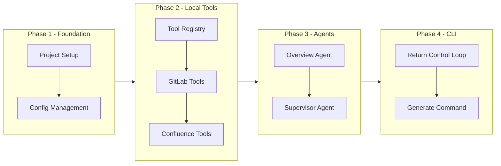

# Code-2-Doc Implementation Plan

This document outlines the step-by-step implementation plan for the Code-2-Doc multi-agent documentation system using the **Return Control** pattern (no Lambda functions required).

## Phase 1: Project Setup and Foundation

### 1.1 Initialize Python Project
- [ ] Create project structure with `src/code2doc/` layout
- [ ] Set up `pyproject.toml` with dependencies:
  - boto3 (AWS Bedrock)
  - click or typer (CLI)
  - pydantic and pydantic-settings
  - python-dotenv (load .env files)
  - python-gitlab
  - atlassian-python-api
  - rich (terminal output)
  - pytest and pytest-asyncio
- [ ] Configure development tools (ruff, mypy, pre-commit)
- [ ] Create virtual environment and install dependencies
- [ ] Create `.gitignore` file (exclude .env, __pycache__, .venv, etc.)

### 1.2 Configuration Management
- [ ] Implement Pydantic settings model in `src/code2doc/config/settings.py`
- [ ] Create YAML configuration loader
- [ ] Create `.env.example` file with all required environment variables:
  - `AWS_REGION` - AWS region for Bedrock
  - `AWS_ACCESS_KEY_ID` - AWS access key (or use AWS CLI profile)
  - `AWS_SECRET_ACCESS_KEY` - AWS secret key (or use AWS CLI profile)
  - `BEDROCK_MODEL_ID` - LLM model ID (e.g., `us.anthropic.claude-opus-4-5-20251101-v1:0`)
  - `GITLAB_URL` - GitLab instance URL
  - `GITLAB_ACCESS_TOKEN` - GitLab personal access token
  - `CONFLUENCE_URL` - Confluence instance URL
  - `CONFLUENCE_USERNAME` - Confluence username/email
  - `CONFLUENCE_ACCESS_TOKEN` - Confluence API token
- [ ] Implement python-dotenv integration for loading `.env` files
- [ ] Create example configuration file `code2doc.yaml.example`

### 1.3 Agent Prompt Files
- [ ] Create `prompts/` directory for all agent prompts
- [ ] Create `prompts/supervisor.md` - Supervisor agent orchestration instructions
- [ ] Create `prompts/erd_agent.md` - ERD documentation agent instructions
- [ ] Create `prompts/event_schema_agent.md` - Event schema agent instructions
- [ ] Create `prompts/api_endpoint_agent.md` - API documentation agent instructions
- [ ] Create `prompts/local_run_guide_agent.md` - Local run guide agent instructions
- [ ] Create `prompts/design_agent.md` - Design documentation agent instructions
- [ ] Create `prompts/overview_agent.md` - Overview agent instructions
- [ ] Create `prompts/resource_dependency_agent.md` - Resource dependency agent instructions
- [ ] Implement prompt loader utility to read prompts from files

## Phase 2: Local Tool Implementation (Return Control)

### 2.1 Tool Registry and Base Classes
- [ ] Create base tool class in `src/code2doc/tools/base.py`
- [ ] Implement tool registry in `src/code2doc/tools/registry.py`
- [ ] Create tool executor for Return Control pattern in `src/code2doc/agents/tool_executor.py`

### 2.2 GitLab Tools (Local Execution)
- [ ] Create GitLab client wrapper in `src/code2doc/tools/gitlab_tools.py`
- [ ] Implement `list_repository_files` function
- [ ] Implement `get_file_content` function
- [ ] Implement `search_code` function
- [ ] Implement `get_repository_structure` function
- [ ] Write unit tests for GitLab tools

### 2.3 Confluence Tools (Local Execution)
- [ ] Create Confluence client wrapper in `src/code2doc/tools/confluence_tools.py`
- [ ] Implement `create_page` function
- [ ] Implement `update_page` function with version comment support
- [ ] Implement `find_or_create_page` function with version management logic
- [ ] Implement `search_pages` function
- [ ] Implement `get_page` function
- [ ] Implement `get_page_by_title` function
- [ ] Implement content hashing for change detection
- [ ] Implement document naming convention logic
- [ ] Write unit tests for Confluence tools

### 2.4 Code Analysis Tools (Local Execution)
- [ ] Create code analysis module in `src/code2doc/tools/code_analysis.py`
- [ ] Implement `analyze_imports` function
- [ ] Implement `extract_functions` function
- [ ] Implement `extract_classes` function
- [ ] Implement `detect_framework` function
- [ ] Write unit tests for code analysis tools

## Phase 3: Bedrock Agent Creation

### 3.1 Agent Setup Script
- [ ] Create Bedrock client wrapper in `src/code2doc/utils/bedrock_client.py`
- [ ] Create agent setup script in `scripts/setup_agents.py`
- [ ] Define action group schemas with RETURN_CONTROL executor type
- [ ] Implement agent creation helper functions
- [ ] Implement sub-agent association functions

### 3.2 Create Specialized Sub-Agents
- [ ] Create ERD Agent with instructions and RETURN_CONTROL action groups
- [ ] Create Event Schema Agent with instructions and action groups
- [ ] Create API Endpoint Agent with instructions and action groups
- [ ] Create Local Run Guide Agent with instructions and action groups
- [ ] Create Design Agent with instructions and action groups
- [ ] Create Overview Agent with instructions and action groups
- [ ] Create Resource Dependency Agent with instructions and action groups
- [ ] Create agent aliases for each sub-agent

### 3.3 Create Supervisor Agent
- [ ] Create Supervisor Agent with SUPERVISOR_ROUTER collaboration type
- [ ] Define orchestration instructions
- [ ] Associate all sub-agents with supervisor
- [ ] Create supervisor agent alias
- [ ] Test supervisor routing logic

## Phase 4: CLI Application Development

### 4.1 CLI Framework Setup
- [ ] Create CLI entry point in `src/code2doc/cli/main.py`
- [ ] Implement global options (--config, --verbose, --dry-run)
- [ ] Set up logging configuration with rich

### 4.2 Return Control Loop
- [ ] Implement agent invocation with Return Control handling
- [ ] Create tool dispatch logic based on returned tool requests
- [ ] Handle tool result submission back to agent
- [ ] Implement conversation loop until agent completes

### 4.3 Generate Command
- [ ] Implement `generate` command in `src/code2doc/cli/commands/generate.py`
- [ ] Add `--topics` option for selecting documentation types
- [ ] Add `--all` flag for generating all documentation
- [ ] Implement progress display using rich
- [ ] Handle parallel agent execution results

### 4.4 Config Command
- [ ] Implement `config` command in `src/code2doc/cli/commands/config.py`
- [ ] Add `config show` subcommand
- [ ] Add `config validate` subcommand
- [ ] Add `config init` subcommand to create template

### 4.5 Status Command
- [ ] Implement `status` command in `src/code2doc/cli/commands/status.py`
- [ ] Display agent availability status
- [ ] Show configuration summary

## Phase 5: Integration and Testing

### 5.1 Integration Tests
- [ ] Write integration tests for GitLab connectivity
- [ ] Write integration tests for Confluence connectivity
- [ ] Write integration tests for Bedrock agent invocation with Return Control
- [ ] Write end-to-end test for single topic generation
- [ ] Write end-to-end test for multi-topic generation

### 5.2 Documentation
- [ ] Write README.md with quick start guide
- [ ] Create detailed setup documentation in `docs/setup.md`
- [ ] Create configuration reference in `docs/configuration.md`
- [ ] Create development guide in `docs/development.md`

## Phase 6: MVP Completion

### 6.1 Final Integration
- [ ] Test complete workflow from CLI to Confluence
- [ ] Verify Return Control loop works correctly
- [ ] Test error handling and recovery
- [ ] Test with sample repositories

### 6.2 Release Preparation
- [ ] Create installation instructions
- [ ] Write release notes
- [ ] Create usage examples

## Implementation Order (MVP Focus)

For a Minimal Viable Product, implement in this order:

**MVP Scope**: Start with just the **Overview Agent** to prove the end-to-end Return Control flow works, then incrementally add other specialized agents.

## Dependencies Between Tasks

| Task | Depends On |
|------|------------|
| Tool Registry | Project Setup |
| GitLab/Confluence Tools | Tool Registry |
| Sub-Agents | Tools implemented locally |
| Supervisor Agent | All Sub-Agents created |
| Return Control Loop | Tools and Agents ready |
| CLI Generate Command | Return Control Loop |
| Integration Tests | All components ready |

## Risk Mitigation

| Risk | Mitigation |
|------|------------|
| Bedrock agent creation complexity | Use workshop examples as reference |
| Return Control loop complexity | Start with simple single-tool test |
| GitLab API rate limits | Implement caching and batch requests |
| Confluence formatting issues | Test markdown conversion thoroughly |
| Large repository handling | Implement file filtering and chunking |
| Agent response latency | Show progress indicators |

## Key Technical Decisions

1. **Return Control Pattern**: Tools execute locally in CLI, not in Lambda
2. **Document Versioning**: Use Confluence native versioning with content hashing
3. **Naming Convention**: `[Project] - [Document Type]` format
4. **Credentials**: Environment variables or local config (not AWS Secrets Manager)
5. **MVP Agent**: Overview Agent first to validate end-to-end flow
